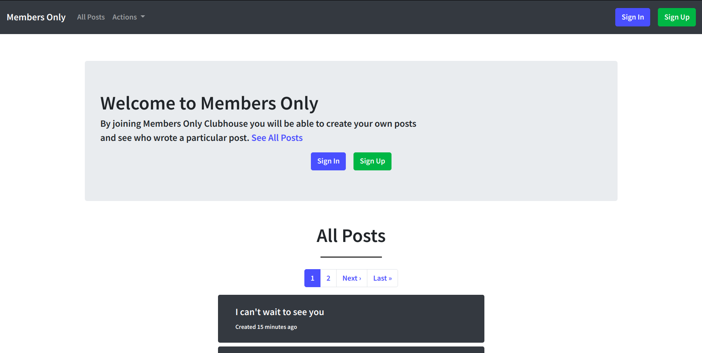
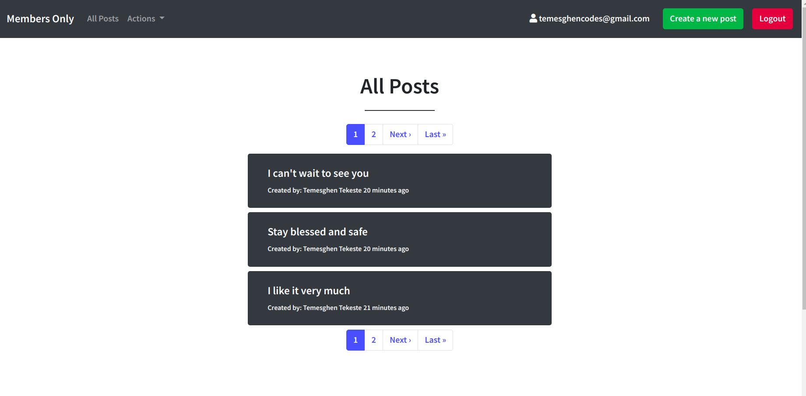
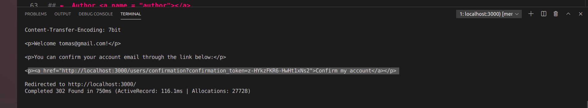

# Members Only

This project is a microverse solo project which is part of the requirements of the microverse main curriculum in the Rails section. The project is about building an exclusive clubhouse to implement the authentication feature of Ruby on Rails MVC framework. The authentication is done using the Devise gem and Bootsrap is used to style the views. The pagination is implemented using the kaminari gem.

In this project, signed in users can create a post and look who wrote a particular post where as a guest user can only see posts without realizing the authors of the posts in the site.

      

<div align="center">

[](https://github.com/temesghentekeste/members-only/tree/feature/bare-metal-form)
[](https://github.com/temesghentekeste/members-only/issues)
[](https://github.com/temesghentekeste/members-only/pulls)

</div>

## 📝 Content

<p align="center">
<a href="#with">Built with</a>&nbsp;&nbsp;&nbsp;|&nbsp;&nbsp;&nbsp;
<a href="#live">Live Demo</a>&nbsp;&nbsp;&nbsp;|&nbsp;&nbsp;&nbsp;
<a href="#sc">Screenshots</a>&nbsp;&nbsp;&nbsp;|&nbsp;&nbsp;&nbsp;
<a href="#gs">Getting started</a>&nbsp;&nbsp;&nbsp;|&nbsp;&nbsp;&nbsp;
<a href="#author">Author</a>
</p>

## 🔧 Built with<a name = "with"></a>

- Ruby on Rails (Version: 6.0.3.2)
- Ruby (Version: 2.7.1)
- Bootsrap 4.5.x
- Kaminari gem
- Devise gem
- PostgreSQL

## 🔴 Live Demo <a name = "live"></a>
*Click [here](https://membersonly-temesghen.herokuapp.com) in order to see a Live Demo of this project.**


## Screenshots <a name = "sc"></a>





## Getting Started <a name = "gs"></a>

To get a local copy of the repository please run the following commands on your terminal:

```
$ git clone git@github.com:temesghentekeste/members-only.git
$ cd members-only
```
- Open the project in your favorite code editor
- Set database credentilas for PostgreSQL in config/database.yml file
~~~bash
$ bundle install
$ rails db:migrate  
~~~

- When signing up to the application, you need an email confirmatin link.
- Copy and paste the one sent on your localhost console
- The picture below shows where to get the link



## ✒️  Author <a name = "author"></a>

👤 **Temesghen Tekeste**

- Github: [@temesghentekeste](https://github.com/temesghentekeste)
- Twitter: [@temesghentekes1](https://twitter.com/temesghentekes1)
- Linkedin: [temsghen-tekeste-bahta-8b5243193](https://www.linkedin.com/in/temesghentekeste/)


## 🤝 Contributing

Contributions, issues and feature requests are welcome!

Feel free to check the [issues page](https://github.com/temesghentekeste/members-only/issues).


## 👍 Show your support

Give a ⭐️ if you like this project!

## :clap: Acknowledgements

- The Odin Project: [@theodinproject](https://www.theodinproject.com/)
- Microverse: [@microverse](https://www.microverse.org/)
